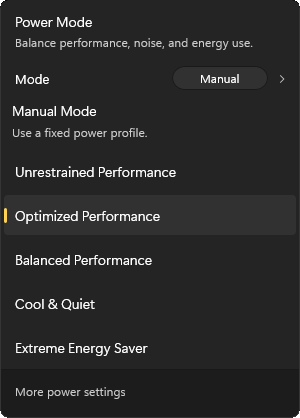
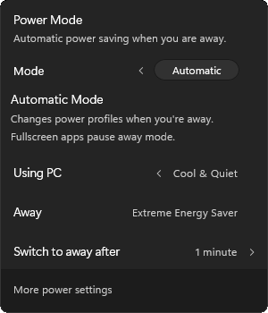
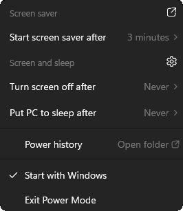
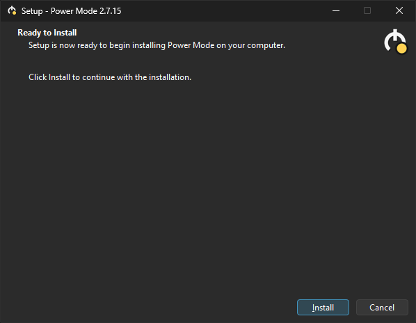

# Power Mode [](https://github.com/MicaLovesKPOP/PowerMode/releases/latest)

Power Mode is a Windows tray utility for quickly switching between custom desktop power profiles from a polished Windows 11-style flyout.

It is designed for desktop PCs where you want quick control over responsiveness, heat, fan noise, and background power use without digging through classic Control Panel power-plan pages.

## Download

Download the latest installer from the [latest release](https://github.com/MicaLovesKPOP/PowerMode/releases/latest).

For the current public release, download:

```text
PowerModeSetup-v2.7.15.exe
```

The matching `.sha256` file is included for checksum verification:

```text
PowerModeSetup-v2.7.15.exe.sha256
```

## Screenshots

### Main flyout

<p align="center">
  
  
</p>

### Tray menu and installer

<p align="center">
  
  
</p>

## Highlights

- Windows 11-style left-click flyout for everyday power profile switching.
- Compact right-click menu for screen saver, display timeout, sleep timeout, startup, Power history, and exit.
- Five custom desktop-oriented power profiles.
- Optional Automatic Mode that switches to a lower-power Away profile when the user is inactive.
- Fullscreen apps pause Away mode by default, so games and fullscreen video are not interrupted.
- Power history with readable summary, event log, and compact stats storage.
- Release installer with dependency checks for .NET 8 Desktop Runtime and Windows App Runtime 1.6.

## Profiles

| Profile | Purpose |
| --- | --- |
| **Unrestrained Performance** | Maximum responsiveness, with higher power use, heat, and fan noise. |
| **Optimized Performance** | Recommended default for a responsive desktop PC. |
| **Balanced Performance** | Recommended default for a balance of responsiveness, noise, and efficiency. |
| **Cool & Quiet** | Lower heat and noise by preventing CPU boost. |
| **Extreme Energy Saver** | Best for background tasks or when away from the PC. |

The three performance profiles are intended to perform practically the same in games and heavy workloads. The real difference is mostly desktop responsiveness, idle/light-load power use, heat, fan noise, and thermal headroom.

The profiles are intentionally desktop-focused first. Laptop and battery-specific behavior is future work.

## Automatic Mode

Automatic Mode is optional and disabled by default. When enabled, it uses two states:

- **Using PC**: the profile used while the user is active.
- **Away**: a lower-power profile used after the configured idle delay.

Default Automatic Mode behavior:

- **Using PC profile:** Optimized Performance
- **Away profile:** Extreme Energy Saver
- **Idle delay:** 15 minutes
- **Fullscreen behavior:** Away mode is blocked while a fullscreen foreground app is active

Returning to the PC immediately exits Away mode.

## Power history

Power history is available from the right-click tray menu.

Opening Power history refreshes the readable summary before opening the folder, so the summary reflects the current session up to that moment without adding fake event-log entries.

It opens a local folder containing:

```text
power-mode-summary.txt
power-mode-events.log
power-mode-stats.json
```

The history tracks Manual time, Automatic active time, Away time, fullscreen-paused time, profile time, switches, and profile changes. The event log is capped to stay small.

User-facing Power history is stored under:

```text
%LOCALAPPDATA%\MicaLovesKPOP\PowerMode\logs
```

## Installer behavior

The release installer:

- installs Power Mode to Program Files;
- appears in Windows Settings > Apps > Installed apps as Power Mode;
- checks/downloads required Microsoft runtimes if missing;
- stops an already-running Power Mode tray process before copying files;
- creates or repairs the five Power Mode profiles;
- sets Optimized Performance active on first setup/repair;
- sets the matching native Windows Power mode overlay;
- installs the current-user Startup folder shortcut;
- starts Power Mode after setup;
- best-effort promotes the tray icon into the visible tray area.

Uninstall removes the app files and startup entry, stops Power Mode, and restores Power Mode global behavior changes where applicable.

Restoring standard Windows power plans is optional because it removes all custom power plans on the PC, not only Power Mode profiles.

Setup and dependency logs are written under:

```text
C:\ProgramData\MicaLovesKPOP\PowerMode\logs
```

## Requirements

Runtime requirements:

- Windows 10 version 2004 or newer, or Windows 11
- x64 Windows installation
- .NET 8 Desktop Runtime x64
- Microsoft Windows App Runtime 1.6 x64

The installer checks for the required Microsoft runtimes and can install them if they are missing.

Build requirements:

- Windows 10/11 x64
- Visual Studio 2022+ with WinUI 3, .NET desktop, and MSBuild support
- Inno Setup 6

## Building

Run:

```bat
Build-Release-Installer.cmd
```

Expected outputs:

```text
dist\PowerModeSetup-v2.7.15.exe
dist\PowerModeSetup-v2.7.15.exe.sha256
dist\build-release-installer.log
```

More release-installer details are in [`README-RELEASE-INSTALLER.txt`](README-RELEASE-INSTALLER.txt).

## Release status

Current public release: **v2.7.15**

Release build status from local testing:

```text
Build succeeded.
0 Warning(s)
0 Error(s)
```

## Known limitations

- Desktop-first behavior; laptop and battery-specific logic is future work.
- Estimated energy savings are intentionally not shown yet, because accurate savings require measured wattage or hardware-specific calibration.
- Automatic Mode currently focuses on user activity, Away behavior, and fullscreen blocking; app-specific profile rules are future work.
- The app currently focuses on the five built-in Power Mode profiles.

## Development note

Power Mode was designed, implemented, reviewed, and documented by MicaLovesKPOP through an iterative AI-assisted development workflow with ChatGPT / GPT-5.5 Thinking (Extended).

All final code, behavior, packaging, release decisions, and project direction were reviewed and accepted by the maintainer. Power Mode is not affiliated with, endorsed by, or sponsored by OpenAI.

## License

GNU General Public License v3.0. See [`LICENSE`](LICENSE).
